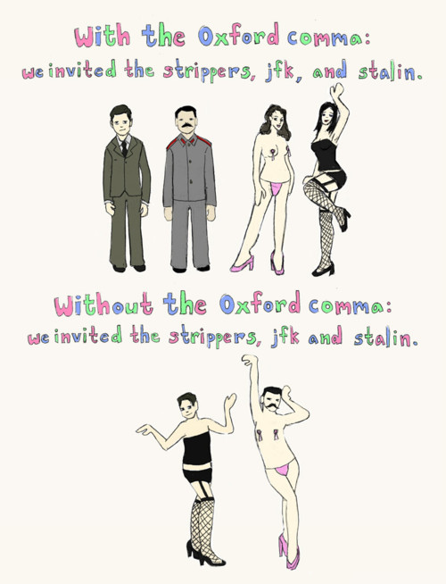

# The Oxford Comma



Punctuation is important.  There is a subtle difference between inviting the strippers, JFK, & Stalin; and inviting the stippers, JKF & Stalin.

Capitalisation is also important.  There's a subtle difference between helping my Uncle Jack off a horse; and helping my uncle ...


## Installation

Reduce the ambiguity of your project by adding this line to your application's Gemfile:

```ruby
gem 'the_oxford_comma'
```

And then execute:

    $ bundle

Or install it yourself as:

    $ gem install the_oxford_comma


## Usage

    ["the strippers", "Kennedy", "Stalin"].and
    # => "the stripers, Kennedy, and Stalin"

    ["the strippers", "Kennedy", "Stalin"].or
    # => "the stripers, Kennedy, and Stalin"    


## Contributing

1. Fork it ( https://github.com/[my-github-username]/the_oxford_comma/fork )
2. Create your feature branch (`git checkout -b my-new-feature`)
3. Commit your changes (`git commit -am 'Add some feature'`)
4. Push to the branch (`git push origin my-new-feature`)
5. Create a new Pull Request

## Why

Why not. 

> "By train, plane and sedan chair, Peter Ustinov retraces a journey made by Mark Twain a century ago. The highlights of his global tour include encounters with Nelson Mandela, an 800-year-old demigod and a dildo collector."
